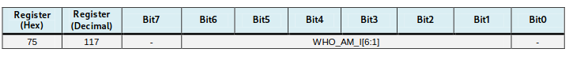

## CUBEMX Configuration

### USART2

- Mode: Asynchronous
- Baud Rate: 115200
- Word Length: 8 bits (including parity)
- Parity: None
- Stop Bits: 1
- Data Direction: Receive and Transmit
- Over Sampling: 16 Samples

### I2C1

- Speed Mode: Standard Mode
- Clock Speed: 100,000 Hz

### Clock

- I changed it to 100 MHz (Max Possible)

### Project Manager

- follow my program STM32 in Arch Guide

## Hardware configuration

```
STM32F4         MPU6050
---------       --------
3.3V/5V ------> VCC
GND     ------> GND
PB6     ------> SCL 
PB7     ------> SDA  
GND     ------> AD0
```

- I externally power the MPU-6050
- There are pull-ups for the I2C lines on the GY-521

## MPU-6050 Usage

### I2C address

Data sheet stipulates:

| AD0 | ADDR    | Hex  |
|-----| ------- | ---- |
| 0   | 1101000 | 0x68 |
| 1   | 1101001 | 0x69 |

but we need to shift it over one to the left:



### Initialization

1. Verify the MPU ID
2. Wake up the device by setting the power management 1 register to 0
3. Set the sample rate divider
4. Configure the accelerometer and gyroscope
	- I'm just gonna do +- 2g for the AFS_SEL
```
sample_rate = gyroscope output rate / (1 + sample rate)
gyro output rate = 1KHz when DLPF_CFG is set to 1-6
sample_rate = 1000Hz / (1 + n)

lets say we want data every 5ms:
5ms = 200 HZ
200 = 1000 / (1 + n) => n = 4

lets say we want data every 8ms:
8ms = 125 HZ
125 = 1000 / (1 + n) => n = 7
```

## Code

### Macros

```c
#define MPU6050_ADDR    (0x68 << 1) // b01101000 << 1
#define WHO_AM_I_REG           0x75
#define PWR_MGMT_1_REG         0x6B
#define SMPLRT_DIV_REG         0x19
#define ACCEL_CONFIG_REG       0x1C
#define ACCEL_XOUT_H_REG       0x3B
#define GYRO_CONFIG_REG        0x1B
#define GYRO_XOUT_H_REG        0x43
```

### Sensor Data Struct

```c
typedef struct {
    int16_t Accel_X_RAW;
    int16_t Accel_Y_RAW;
    int16_t Accel_Z_RAW;
    int16_t Gyro_X_RAW;
    int16_t Gyro_Y_RAW;
    int16_t Gyro_Z_RAW;
    float Ax, Ay, Az;
    float Gx, Gy, Gz;
} MPU6050_t;
```

### Helper I2C Functions

```c
HAL_StatusTypeDef MPU6050_Write(uint8_t reg, uint8_t data)
{
    uint8_t buf[2] = {reg, data};
    return HAL_I2C_Master_Transmit(&hi2c1, MPU6050_ADDR, buf, 2, HAL_MAX_DELAY);
}

HAL_StatusTypeDef MPU6050_Read(uint8_t reg, uint8_t *data, uint8_t len)
{
    HAL_I2C_Master_Transmit(&hi2c1, MPU6050_ADDR, &reg, 1, HAL_MAX_DELAY);
    return HAL_I2C_Master_Receive(&hi2c1, MPU6050_ADDR, data, len, HAL_MAX_DELAY);
}
```

### MPU-6050 Init Function

```c
void MPU6050_Init(void)
{
    char msg[50];
    uint8_t ID;
    HAL_Delay(100);
    
    // Check device ID
    HAL_StatusTypeDef status = MPU6050_Read(WHO_AM_I_REG, &ID, 1);
    sprintf(msg, "Status: %d, MPU ID: 0x%02X\r\n", status, ID);
    HAL_UART_Transmit(&huart2, (uint8_t*)msg, strlen(msg), HAL_MAX_DELAY);    

    if (ID == 0x68) {
        // Wake up device
        MPU6050_Write(PWR_MGMT_1_REG, 0x00);
        MPU_read_print(PWR_MGMT_1_REG);
        HAL_Delay(100);
        // Set sample rate
        MPU6050_Write(SMPLRT_DIV_REG, 0x07);
        MPU_read_print(SMPLRT_DIV_REG);
        // Set accelerometer configuration
        MPU6050_Write(ACCEL_CONFIG_REG, 0x00);
        MPU_read_print(ACCEL_CONFIG_REG);
        // Set gyroscope configuration
        MPU6050_Write(GYRO_CONFIG_REG, 0x00);
        MPU_read_print(GYRO_CONFIG_REG);
    }
}
```

### Read All Sensor Data
```c
void MPU6050_Read_All(MPU6050_t *DataStruct)
{
    uint8_t Rec_Data[14];
    char buf[500];

    // Read 14 bytes of data starting from ACCEL_XOUT_H register
    MPU6050_Read(ACCEL_XOUT_H_REG, Rec_Data, 14);

    // Store raw values
    DataStruct->Accel_X_RAW = (int16_t)(Rec_Data[0] << 8 | Rec_Data[1]);
    DataStruct->Accel_Y_RAW = (int16_t)(Rec_Data[2] << 8 | Rec_Data[3]);
    DataStruct->Accel_Z_RAW = (int16_t)(Rec_Data[4] << 8 | Rec_Data[5]);
    DataStruct->Gyro_X_RAW = (int16_t)(Rec_Data[8] << 8 | Rec_Data[9]);
    DataStruct->Gyro_Y_RAW = (int16_t)(Rec_Data[10] << 8 | Rec_Data[11]);
    DataStruct->Gyro_Z_RAW = (int16_t)(Rec_Data[12] << 8 | Rec_Data[13]);

    // Print raw values first
    // sprintf(buf, "Raw - Accel: X=%d Y=%d Z=%d  Gyro: X=%d Y=%d Z=%d\r\n",
    //    DataStruct->Accel_X_RAW, DataStruct->Accel_Y_RAW, 
	//    DataStruct->Accel_Z_RAW, DataStruct->Gyro_X_RAW, 
	//    DataStruct->Gyro_Y_RAW, DataStruct->Gyro_Z_RAW);
    //HAL_UART_Transmit(&huart2, (uint8_t*)buf, strlen(buf), HAL_MAX_DELAY);

    // Convert raw accel values (LSB Sensitivity 16,384 LSB/g)
    DataStruct->Ax = (float)DataStruct->Accel_X_RAW / 16384.0f;
    DataStruct->Ay = (float)DataStruct->Accel_Y_RAW / 16384.0f;
    DataStruct->Az = (float)DataStruct->Accel_Z_RAW / 16384.0f;
	// Convert raw gyro values (LSB Sensitivity 131 LSB/deg/s))
    DataStruct->Gx = (float)DataStruct->Gyro_X_RAW / 131.0f;
    DataStruct->Gy = (float)DataStruct->Gyro_Y_RAW / 131.0f;
    DataStruct->Gz = (float)DataStruct->Gyro_Z_RAW / 131.0f;

    // Print converted values
    sprintf(buf, "Converted - Accel: X=%.2f Y=%.2f Z=%.2f  Gyro: X=%.2f Y=%.2f Z=%.2f\r\n",
        DataStruct->Ax, DataStruct->Ay, DataStruct->Az,
        DataStruct->Gx, DataStruct->Gy, DataStruct->Gz);
    HAL_UART_Transmit(&huart2, (uint8_t*)buf, strlen(buf), HAL_MAX_DELAY);
}
```

### Main

```c
int main(void)
{
  HAL_Init();
  SystemClock_Config();
  MX_GPIO_Init();
  MX_I2C1_Init();
  MX_USART2_UART_Init();
  
  MPU6050_Init();
  MPU6050_t MPU6050_Data;

  while (1)
  {
    MPU6050_Read_All(&MPU6050_Data);
    HAL_Delay(100); 
  }
}
```

## Printing Floats

The floats were missing from the UART prints by default and I had to modify the linker flags in the Makefile
```Makefile
LDFLAGS += -u _printf_float
```

## Moving Average Filter

Since the data has a lot of noise, applying a moving average filter is an easy way to create a more stable output
- M is the number of samples
$y[i] = \frac{1}{M} \sum_{j=0}^{M-1} x[i+j]$

### Filter struct to hold the 3 axis value

```c
#define samples 50
typedef struct {
    float data[3][samples];
    uint8_t index;
    uint8_t count;
    float sum[3];
    float avg[3];   // x, y, z
} MAV;

void mav_init(MAV *filter)
{
    if (filter == NULL)
        return;

    memset(filter->data, 0, sizeof(filter->data));
    memset(filter->sum, 0, sizeof(filter->sum));
    memset(filter->avg, 0, sizeof(filter->avg));
    filter->index = 0;
    filter->count = 0;
}
```

### Moving average filter calculation

Not the prettiest but I just wanted to test

```c
void mav_calc(MAV *filter, MPU6050_t *new_data)
{
	// If the data array is full, remove it from sum & decrease count
    if (filter->count == samples) {
        filter->sum[0] -= filter->data[0][filter->index];
        filter->sum[1] -= filter->data[1][filter->index];
        filter->sum[2] -= filter->data[2][filter->index];
        filter->count--;
    }
    
    // Add new data to array and sum
    filter->data[0][filter->index] = new_data->Gx;
    filter->data[1][filter->index] = new_data->Gy;
    filter->data[2][filter->index] = new_data->Gz;
    
    filter->sum[0] += new_data->Gx;
    filter->sum[1] += new_data->Gy;
    filter->sum[2] += new_data->Gz;
    
    // increase count
    filter->count++;

    // calculate new avg and move index
    filter->avg[0] = filter->sum[0] / samples;
    filter->avg[1] = filter->sum[1] / samples;
    filter->avg[2] = filter->sum[2] / samples;

    filter->index = (filter->index + 1) % samples;
}

void mav_print(MAV *filterA, MAV *filterG)
{
    char buf[200];

    sprintf(buf, "MAV Accel: X=%.2f Y=%.2f Z=%.2f  MAV Gyro: X=%.2f Y=%.2f Z=%.2f\r\n",
            filterA->avg[0], filterA->avg[1], filterA->avg[2],
            filterG->avg[0], filterG->avg[1], filterG->avg[2]);
    HAL_UART_Transmit(&huart2, (uint8_t*)buf, strlen(buf), HAL_MAX_DELAY);
}
```

### Updated main()
```c

int main(void)
{
  HAL_Init();
  SystemClock_Config();
  
  /* Initialize all configured peripherals */
  MX_GPIO_Init();
  MX_I2C1_Init();
  MX_USART2_UART_Init();

  MPU6050_Init();
  MPU6050_t MPU6050_Data;
  MAV filter_accel;
  MAV filter_gyro;
  mav_init(&filter_accel);
  mav_init(&filter_gyro);

  while (1)
  {
    MPU6050_Read_All(&MPU6050_Data);
    mav_calc(&filter_accel, &MPU6050_Data);
    mav_calc(&filter_gyro, &MPU6050_Data);
    mav_print(&filter_accel, &filter_gyro);
    HAL_Delay(100); 
  }
}
```

## TODO

- timer based read/dma

### References

- https://cdn.sparkfun.com/datasheets/Sensors/Accelerometers/RM-MPU-6000A.pdf
- https://invensense.tdk.com/wp-content/uploads/2015/02/MPU-6000-Datasheet1.pdf
- https://deepbluembedded.com/mpu6050-with-microchip-pic-accelerometer-gyroscope-interfacing-with-pic/
